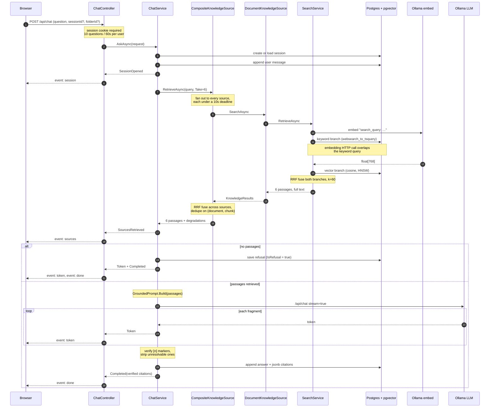
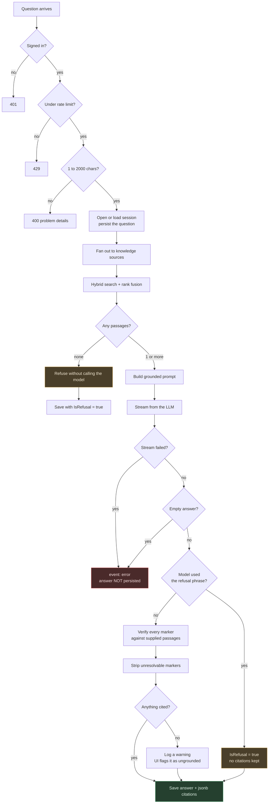
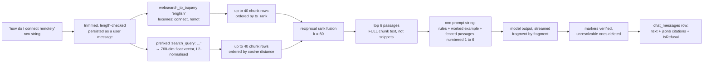
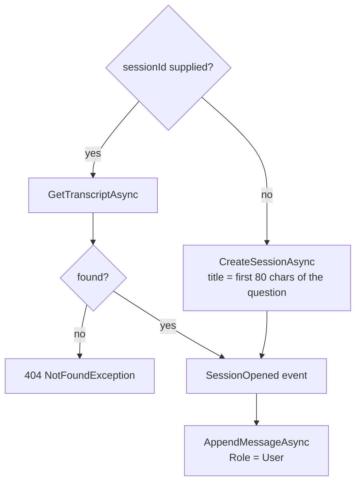
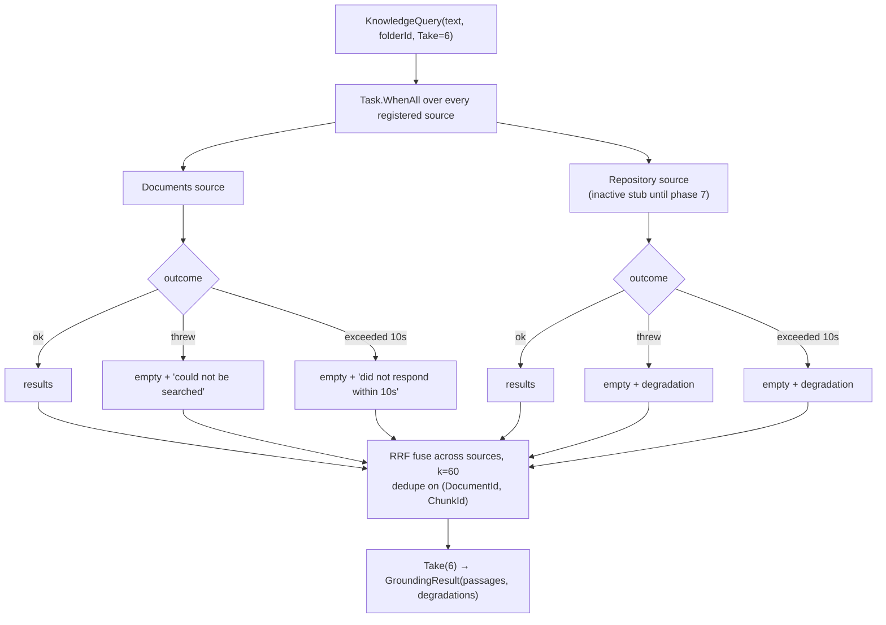
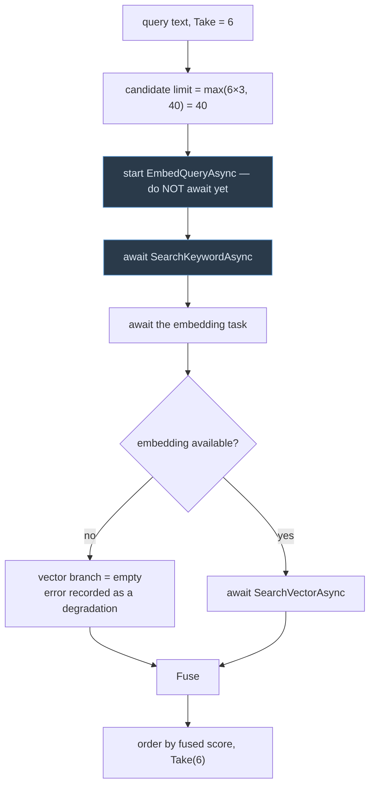
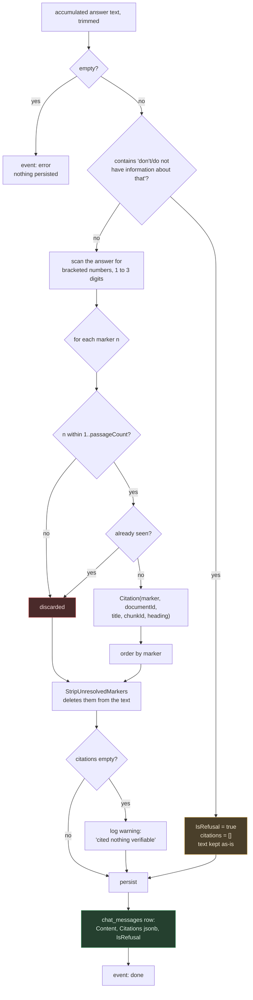

# How the assistant answers a question

What happens between a user pressing Enter in the assistant and a cited answer
appearing on screen. Every step below is traced to the code that performs it.

This is the *runtime* path. How text got into the index in the first place —
extract, chunk, embed, store — is the ingestion pipeline, summarised in
[README.md](README.md#how-ingestion-and-search-work).

**The one-sentence version:** the question is turned into both a `tsquery` and a
768-dimension vector, those two searches are fused by rank position into six
passages, the passages are pasted verbatim into a prompt that forbids answering
from anything else, the model streams an answer, and every `[n]` marker it emits
is checked against the passages it was actually given before the answer is saved.

---

## Contents

- [The whole path at a glance](#the-whole-path-at-a-glance)
- [What happens to the text](#what-happens-to-the-text)
- [Stage 0 — Admission](#stage-0--admission)
- [Stage 1 — Session and the question](#stage-1--session-and-the-question)
- [Stage 2 — Retrieval](#stage-2--retrieval)
- [Stage 3 — The refuse-or-generate gate](#stage-3--the-refuse-or-generate-gate)
- [Stage 4 — Building the grounded prompt](#stage-4--building-the-grounded-prompt)
- [Stage 5 — Generation](#stage-5--generation)
- [Stage 6 — Verification and persistence](#stage-6--verification-and-persistence)
- [Stage 7 — What the browser does](#stage-7--what-the-browser-does)
- [Failure modes](#failure-modes)
- [Configuration that changes behaviour](#configuration-that-changes-behaviour)
- [Code map](#code-map)
- [Invariants worth not breaking](#invariants-worth-not-breaking)

---

## The whole path at a glance



The decision points, without the plumbing:



---

## What happens to the text

The same question exists in five different representations before an answer
comes back. Following those transformations is the shortest way to understand
the pipeline.



Two things about this diagram matter more than the rest:

**The passages carry full chunk text, not the snippets the search screen shows.**
[SearchService.cs:76](server/src/DocHub.Services/Search/SearchService.cs:76) —
the model has to reason over the whole passage, whereas a human scanning results
only needs a window. The 320-character snippet exists solely for the search UI.

**Only rank position survives fusion.** `ts_rank` and cosine similarity are on
unrelated scales, so the scores themselves are thrown away and only the ordering
is used. Fusing them any other way would require inventing a weighting.

---

## Stage 0 — Admission

Three gates, all before any work happens.

| Gate | Where | Behaviour |
|---|---|---|
| Session cookie | Fallback authorisation policy in `Program.cs` | `/api/chat` has no `[AllowAnonymous]`, so a missing session is a 401 |
| Rate limit | `[EnableRateLimiting(RateLimiting.ChatPolicy)]` on the controller | Fixed window, **10 questions per 60 seconds per user**, then 429 |
| Validation | [ChatService.cs:31-36](server/src/DocHub.Services/Chat/ChatService.cs:31) | Empty question, or over 2,000 characters, throws `ValidationException` → 400 |

The length cap is a grounding decision, not just hygiene: a pasted wall of text
would push the retrieved passages out of the model's context window, which is
exactly the failure the whole design is built to avoid.

**The first event is pulled before any bytes are written.**
[ChatController.cs:39](server/src/DocHub.Api/Controllers/ChatController.cs:39):

```csharp
if (!await events.MoveNextAsync()) return;

Response.StatusCode = StatusCodes.Status200OK;
Response.ContentType = "text/event-stream";
```

Once a byte of the stream is sent, the status code is committed and every later
error has to be reported *inside* the stream. Advancing the iterator once first
means a validation failure or an unknown session still comes back as a normal
RFC 7807 problem-details response with the right status code.

---

## Stage 1 — Session and the question



The question is persisted **before** retrieval or generation
([ChatService.cs:61](server/src/DocHub.Services/Chat/ChatService.cs:61)). That
ordering is deliberate: if generation later fails, the question survives and a
retry does not inherit a broken answer — the failed turn is simply never written
as an assistant message.

The session title comes from the opening question, collapsed to single spaces and
truncated at 80 characters with an ellipsis, so conversation history reads as a
list of questions rather than of timestamps.

---

## Stage 2 — Retrieval

This is the substantial part. It happens at three nested levels.

### 2a. Fan-out across sources

[CompositeKnowledgeSource.cs](server/src/DocHub.Services/Knowledge/CompositeKnowledgeSource.cs)



Four decisions are encoded here:

- **Every source gets the full budget of 6, not a share of it.**
  [CompositeKnowledgeSource.cs:66-71](server/src/DocHub.Services/Knowledge/CompositeKnowledgeSource.cs:66).
  Splitting it would cap a strong source based only on how many other sources
  happen to be registered — including ones that returned nothing.
- **Failure is isolated per source.** A source that throws contributes an empty
  list plus a human-readable degradation string, never an exception that fails
  the question.
- **Each source runs under its own deadline**, linked to the caller's token. The
  distinction at
  [CompositeKnowledgeSource.cs:191](server/src/DocHub.Services/Knowledge/CompositeKnowledgeSource.cs:191)
  — `when (!ct.IsCancellationRequested)` — is what separates *our* 10-second
  timeout from *the client* disconnecting. A client who gave up wants everything
  abandoned; a slow source is just left out.
- **`ValidationException` is deliberately re-thrown**
  ([line 184](server/src/DocHub.Services/Knowledge/CompositeKnowledgeSource.cs:184)).
  A malformed query is the caller's fault and applies to every source, so it must
  surface as a 400 rather than be reported as this source being unwell.

> **Concurrency invariant:** at most one source may touch the request-scoped
> `DbContext` — the documents source. A second database-backed source added to
> this fan-out must run sequentially with it, or it will fail intermittently:
> passing under a slow provider and failing under a fast one.

### 2b. Hybrid search inside the documents source

[SearchService.RankAsync](server/src/DocHub.Services/Search/SearchService.cs:90)
is shared by both the search screen and the assistant. That sharing is a
grounding guarantee: **the assistant can only cite what a user searching the same
words would have been shown.**



The ordering on lines
[123-130](server/src/DocHub.Services/Search/SearchService.cs:123) is load-bearing
and cost real debugging time:

```csharp
var embeddingTask = EmbedQueryAsync(query, ct);   // started, not awaited

var keyword = await chunks.SearchKeywordAsync(filter, ct);

var (embedding, embeddingError) = await embeddingTask;
var (vector, vectorError) = embedding is null ? ([], embeddingError)
    : await SearchVectorAsync(filter, embedding, ct);
```

The embedding HTTP round trip is the slowest single thing in a search, so it is
started first and overlaps the keyword query. But **the two database queries are
deliberately not concurrent** — they share one request-scoped `DbContext`, which
cannot serve two commands at once. Issuing them together fails, and fails
*intermittently*, because a slow embedding provider hides the race by letting the
keyword query finish first.

Both branches apply the same filter
([ChunkRepository.ApplyFiltersAsync](server/src/DocHub.DataAccess/Repositories/ChunkRepository.cs:146)):

| Filter | Effect |
|---|---|
| `Status == Indexed` | **Always applied.** A half-processed or failed document is neither searchable nor citable |
| `FolderId` | Scoped by materialised path — the folder and its whole subtree. An unknown id returns `null`, so the query is skipped entirely rather than run and guaranteed to match nothing |
| `OwnerId`, `Extensions`, `Tags` | Optional narrowing from the search UI |

**Keyword branch** — [ChunkRepository.cs:71](server/src/DocHub.DataAccess/Repositories/ChunkRepository.cs:71).
Postgres full-text search over the generated `tsvector` column, ranked by
`ts_rank`. It uses `websearch_to_tsquery`, not `to_tsquery`, so quotes, `OR` and
stray punctuation from a real user never throw a syntax error back at them.

> **Trap:** `EF.Functions.WebSearchToTsQuery` must appear *inline inside* the
> LINQ expression, repeated at each use. EF only translates calls present in the
> expression tree; hoisting it into a local throws at runtime asking to be
> rewritten exactly as it is.

**Vector branch** — [ChunkRepository.cs:110](server/src/DocHub.DataAccess/Repositories/ChunkRepository.cs:110).
Ordered by `Embedding.CosineDistance(vector)`, which is what lets Postgres use
the HNSW index. The `1 - distance` similarity in the projection is for display
only and does not affect the query plan.

The query embedding is prefixed with `search_query: ` before being sent to
`nomic-embed-text`, matching the `search_document: ` prefix used at ingestion.
These task prefixes are what the model was trained with; dropping them costs
retrieval accuracy silently. The returned vector is L2-normalised.

### 2c. Reciprocal rank fusion

[SearchService.Fuse](server/src/DocHub.Services/Search/SearchService.cs:196).
Each chunk scores `1 / (60 + rank + 1)` in every branch that found it, and the
scores add.

A worked example with three chunks:

| Chunk | Keyword rank | Vector rank | Score | Result |
|---|---|---|---|---|
| A | 0 | 2 | `1/61 + 1/63` = **0.03227** | 1st — both branches agree |
| B | 1 | — | `1/62` = 0.01613 | 2nd |
| C | — | 0 | `1/61` = 0.01639 | Actually 2nd; C edges out B |

The property that matters: a chunk **both** branches found outranks one that only
a single branch found, without ever comparing a `ts_rank` to a cosine similarity.
Each branch is asked for 40 candidates rather than 6, because fusion can only
reorder what it was given.

Fusion then happens a *second* time across sources in
`CompositeKnowledgeSource`, with the same constant. With only the documents
source registered that pass is order-preserving — it re-scores a single ranked
list monotonically — so today it is a no-op that becomes meaningful the moment a
second source exists. Its dedupe on `(DocumentId, ChunkId)` is what stops two
sources indexing the same file from spending two citation slots on one passage.

---

## Stage 3 — The refuse-or-generate gate

[ChatService.cs:93](server/src/DocHub.Services/Chat/ChatService.cs:93)

```csharp
if (passages.Count == 0)
{
    var refusal = await SaveRefusalAsync(sessionId, NoSourcesMessage(retrieval), ct);
    yield return new ChatEvent.Token(refusal.Content);
    yield return new ChatEvent.Completed(refusal.Id, [], IsRefusal: true);
    yield break;
}
```

**The model is never called with zero passages.** That is not an optimisation —
asking a language model to answer with no sources is precisely the situation that
produces confident fabrication, so the refusal is generated in code and the model
is skipped entirely.

The refusal text distinguishes two cases that look identical from the outside
([NoSourcesMessage](server/src/DocHub.Services/Chat/ChatService.cs:305)):

- **Nothing matched** → "Nothing in the indexed documents matched this question.
  Only documents that finished ingestion are searchable."
- **Something could not be searched** → the degradation strings are appended, so
  the user learns the answer may exist somewhere that was not reached.

Only one of those means the answer does not exist, and conflating them would be a
lie by omission.

---

## Stage 4 — Building the grounded prompt

[GroundedPrompt.Build](server/src/DocHub.Services/Chat/GroundedPrompt.cs:34) —
pure functions over their arguments, no model and no database, so the grounding
rules and citation checking are unit-testable directly rather than by observing a
model's behaviour.

The assembled system prompt is:

```
You are the assistant for an internal documentation hub. You answer questions
using ONLY the numbered sources below.

EVERY SENTENCE YOU WRITE MUST END WITH A SOURCE NUMBER IN SQUARE BRACKETS.

   … a worked example of a correct two-sentence answer …

Rules:
  1. Use only what the sources say.
  2. End every sentence with the bracketed number of the source it came from.
  3. Only use numbers that appear in the source list below.
  4. If the sources do not answer the question, reply with exactly:
     I don't have information about that in the indexed documents.
  5. Partial information is not a failure.
  6. Answer in prose, briefly.

SOURCES

[1] Remote Access Policy — Connecting from outside the office
---
<full chunk text, verbatim>
---

[2] …

Reminder: end every sentence with a bracketed source number, like [1].
```

Four choices in that layout, each with a specific failure it prevents:

| Choice | Prevents |
|---|---|
| Passages fenced with `---` delimiters | A model that cannot tell where one source ends blending two into one confident, wrong sentence |
| A worked example, not just a rule | Small models follow a demonstrated format far more reliably than a described one |
| The citation rule repeated *last* | A small model weights the end of a long prompt much more heavily than the middle — and this is the one instruction whose failure is invisible in an otherwise good answer |
| Markers 1-based | They read naturally, and match the numbering the client already displayed |

Alongside the system prompt, `BuildHistory` replays the last
`HistoryTurns × 2 = 8` messages plus the new question
([ChatService.cs:265](server/src/DocHub.Services/Chat/ChatService.cs:265)). The
window is bounded because the passages are the expensive part of the prompt: an
unbounded transcript would crowd them out, and the failure mode is an assistant
that stops seeing its own sources.

---

## Stage 5 — Generation

[OllamaLlmProvider.StreamAsync](server/src/DocHub.Integrations/Llm/OllamaLlmProvider.cs:29)
posts to Ollama's `/api/chat` with `stream: true`:

```json
{
  "model": "llama3.2:3b",
  "messages": [
    { "role": "system", "content": "<the grounded prompt>" },
    { "role": "user",   "content": "<earlier question>" },
    { "role": "assistant", "content": "<earlier answer>" },
    { "role": "user",   "content": "how do I connect remotely" }
  ],
  "stream": true,
  "options": { "temperature": 0.1, "num_predict": 1024, "num_ctx": 8192 }
}
```

Three settings are not defaults and the assistant is wrong without them:

- **`num_ctx: 8192`.** Ollama's own default is **2048**, and it enforces it by
  *silently discarding the overflow*. The grounded prompt is the rules, the
  example, and six passages of up to 800 tokens each — comfortably past 2048. Set
  too low, there is no error: the model is simply asked to cite sources that were
  cut before it ever saw them.
- **`temperature: 0.1`.** The job is to restate what the passages say. Sampling
  variety is exactly how a model starts inventing details the sources do not
  contain.
- **`HttpCompletionOption.ResponseHeadersRead`.** Without it `HttpClient` buffers
  the entire body before returning, defeating streaming completely.

Ollama replies with newline-delimited JSON — one object per fragment, not SSE. A
malformed line throws rather than being skipped: a response that can no longer be
parsed is not trustworthy, and handing back half an answer as though whole is
worse than failing.

Each fragment is simultaneously appended to a `StringBuilder` and yielded as a
`Token` event, so the browser renders progressively while the service accumulates
the full text it needs for verification.

`StreamSafelyAsync` ([ChatService.cs:212](server/src/DocHub.Services/Chat/ChatService.cs:212))
exists for a C# language reason worth knowing: an iterator cannot `yield` from
inside a `catch`. So the `MoveNextAsync` advance is wrapped, the failure is
captured as a *value*, and it is surfaced after the try block — which is what
lets a partial answer still reach the client when generation dies mid-sentence.

---

## Stage 6 — Verification and persistence

This is the stage that makes the citation contract real rather than aspirational.



**Why verification is not optional.** A model asked to cite will occasionally
produce a plausible-looking `[7]` when it was given four sources. Rendered
naively that becomes a link to nothing, and — worse — makes the answer look
better supported than it is. So markers outside range are dropped from the
citation list *and* deleted from the answer text by
[`StripUnresolvedMarkers`](server/src/DocHub.Services/Chat/GroundedPrompt.cs:153).
An unfollowable citation never reaches the screen.

**Refusal detection is deliberately loose.**
[`IsRefusal`](server/src/DocHub.Services/Chat/GroundedPrompt.cs:145) matches on
the distinctive fragment `"don't have information about that"` (and the
`"do not"` variant) rather than the whole sentence, because a small model
reproduces the phrase closely but rarely character-for-character.

**`IsRefusal` is stored explicitly, never inferred from having no citations.** A
refusal and a failure-to-cite are different things and render differently: one is
information, the other is a warning that the answer is ungrounded.

**Citations are stored as `jsonb` on the message, denormalising the document
title and heading.** This is why renaming or deleting a document cannot rewrite
what a historical answer claimed to be based on. The trade — stale titles after a
rename — is the correct one for an audit trail.

---

## Stage 7 — What the browser does

Five SSE event names, each with a distinct job:

| Event | Payload | What the UI does |
|---|---|---|
| `session` | `sessionId`, `title` | Makes a brand-new conversation addressable |
| `sources` | all retrieved passages, numbered | Renders the source list **while the answer is still being written** |
| `token` | `text` | Appends to the streaming answer |
| `done` | `messageId`, **verified** citations, `isRefusal` | Replaces the provisional source list with what was actually cited |
| `error` | `reason` | Shows a failure, distinct from a refusal |

> **The subtlety worth internalising:** `sources` carries everything *retrieved*
> (all six), while `done` carries only what was *verified as cited* (a subset).
> The client shows candidates early for legibility, then reconciles to the truth
> when the answer completes. The marker numbering is consistent between the two
> because both derive from the same ordered passage list —
> [ChatService.cs:83](server/src/DocHub.Services/Chat/ChatService.cs:83) uses
> `index + 1`, and `GroundedPrompt.Build` numbers `[i + 1]` over that same list.

The client uses `fetch`, not Angular's `HttpClient`
([http-knowledge-gateway.ts:366](client/src/app/core/data/http-knowledge-gateway.ts:366)),
because `HttpClient` buffers the whole response before emitting — which would
defeat streaming entirely. This is the single documented exception to the rule
that no component touches HTTP directly; everything else goes through
`KnowledgeGateway`.

Consequences of using `fetch`: the auth interceptor cannot reach the call, so
`credentials: 'include'` attaches the session cookie explicitly. And
unsubscribing aborts the request, which cancels it server-side — navigating away
actually stops the model rather than leaving it generating into a void. An abort
is treated as an unsubscribe, not an error.

Frames are split on the blank line separator, with a partial trailing frame held
in a buffer until the rest arrives. Unknown event names are ignored rather than
thrown on, so a future server event will not break an older client.

Citations link to `/docs/:id?chunk=N`, which opens the document with that exact
passage highlighted.

**Response buffering must be off in front of all of this.** `proxy_buffering off`
in nginx, `responseBufferLimit="0"` in `web.config`, plus the
`X-Accel-Buffering: no` header the controller sets. None of these fail loudly —
the symptom is simply that the answer arrives in one lump.

---

## Failure modes

| What breaks | What the user gets | Where |
|---|---|---|
| Embedding provider down | Keyword-only results, recorded as a degradation. Search says "Semantic matching is unavailable"; the assistant still answers | [SearchService.cs:149](server/src/DocHub.Services/Search/SearchService.cs:149) |
| Vector query fails | Same — keyword half is still worth answering from | [SearchService.cs:166](server/src/DocHub.Services/Search/SearchService.cs:166) |
| One knowledge source throws | Left out of this one answer, named in a degradation string | [CompositeKnowledgeSource.cs:203](server/src/DocHub.Services/Knowledge/CompositeKnowledgeSource.cs:203) |
| One source hangs | Dropped after 10s, named in a degradation string | [CompositeKnowledgeSource.cs:191](server/src/DocHub.Services/Knowledge/CompositeKnowledgeSource.cs:191) |
| **Every** source fails | Refusal path, and the message says the answer may exist somewhere unreachable | [ChatService.cs:305](server/src/DocHub.Services/Chat/ChatService.cs:305) |
| Nothing matched | Refusal: "Only documents that finished ingestion are searchable" | same |
| LLM unreachable or errors | `event: error`, "The assistant is unavailable (…)". The question stays saved; **no answer is persisted**, so a retry starts clean | [ChatService.cs:234](server/src/DocHub.Services/Chat/ChatService.cs:234) |
| LLM returns empty | `event: error`, "The model returned an empty answer" | [ChatService.cs:134](server/src/DocHub.Services/Chat/ChatService.cs:134) |
| Model invents `[7]` | Marker stripped from the text, excluded from citations | [GroundedPrompt.cs:109](server/src/DocHub.Services/Chat/GroundedPrompt.cs:109) |
| Model cites nothing | Answer saved, warning logged, UI flags it as not grounded | [ChatService.cs:150](server/src/DocHub.Services/Chat/ChatService.cs:150) |
| `num_ctx` too low | **Silent.** Passages are truncated away and the model cites sources it never saw | [LlmOptions.cs:34](server/src/DocHub.Integrations/Llm/LlmOptions.cs:34) |
| Client disconnects | The linked cancellation token aborts retrieval and generation | [ChatController.cs:52](server/src/DocHub.Api/Controllers/ChatController.cs:52) |

### One known gap

`GroundingResult.Degradations` is consumed in exactly one place —
[`NoSourcesMessage`](server/src/DocHub.Services/Chat/ChatService.cs:305), which
only runs when `passages.Count == 0`. So when a source fails *but the remaining
sources still return passages*, the degradation string is computed and then
dropped: no `ChatEvent` carries it, and the user is not told the grounding was
thinner than usual.

That is narrower than the invariant stated in
[CLAUDE.md](CLAUDE.md) — "a knowledge source that fails is left out of that one
answer and named in the reply". The isolation and the deadline both work
correctly; it is only the *reporting* on the partial-success path that is
missing. Closing it would mean adding a degradation field to
`ChatEvent.Completed` (or a new event) and surfacing it in the assistant UI.

---

## Configuration that changes behaviour

| Key | Default | Effect on an answer |
|---|---|---|
| `Chat:PassageCount` | 6 | The main quality lever, and it cuts both ways: too few loses context that exists, too many buries the relevant passage among near-misses the model blends together |
| `Chat:HistoryTurns` | 4 | Turns replayed for follow-ups like "what about the second one?". Higher crowds out passages |
| `Chat:MaxQuestionLength` | 2000 | Rejects pasted documents |
| `Knowledge:SourceTimeoutSeconds` | 10 | Per-source deadline. Not a latency target — the point past which waiting is worse than answering without that source |
| `Llm:Model` | `llama3.2:3b` | `llama3.1:8b` / `qwen2.5:7b` follow the citation format noticeably better, at the cost of speed |
| `Llm:ContextTokens` | 8192 | Must hold rules + example + every passage + history. **Too low fails silently** |
| `Llm:Temperature` | 0.1 | Higher invents details the sources do not contain |
| `Llm:MaxOutputTokens` | 1024 | Ceiling on answer length; truncating mid-citation is worse than a slow reply |
| `Llm:TimeoutSeconds` | 180 | Generous — the first call after a container start pays to load the model into memory |
| `Embeddings:Model` | `nomic-embed-text` | Changing width needs a migration **and** a full re-index |
| `Embeddings:Dimensions` | 768 | Must equal the migrated column width |
| `Embeddings:QueryPrefix` | `search_query: ` | Task prefix the model was trained with; empty costs accuracy silently |
| `RateLimits:ChatRequests` / `ChatWindowSeconds` | 10 / 60 | Questions per user per window |

`RankFusionConstant = 60` is a `const` in both `SearchService` and
`CompositeKnowledgeSource`, not configuration — it is the value from the original
RRF paper and behaves well untuned.

---

## Code map

| File | Responsibility |
|---|---|
[Api/Controllers/ChatController.cs](server/src/DocHub.Api/Controllers/ChatController.cs) | SSE framing, header timing, rate-limit attribute |
[Services/Chat/ChatService.cs](server/src/DocHub.Services/Chat/ChatService.cs) | The orchestrator: retrieve → refuse-or-generate → verify → persist |
[Services/Chat/GroundedPrompt.cs](server/src/DocHub.Services/Chat/GroundedPrompt.cs) | Prompt construction, citation verification, refusal detection. Pure functions |
[Services/Chat/IChatService.cs](server/src/DocHub.Services/Chat/IChatService.cs) | The `ChatEvent` union |
[Services/Knowledge/CompositeKnowledgeSource.cs](server/src/DocHub.Services/Knowledge/CompositeKnowledgeSource.cs) | Fan-out, deadlines, failure isolation, cross-source fusion, dedupe |
[Services/Knowledge/DocumentKnowledgeSource.cs](server/src/DocHub.Services/Knowledge/DocumentKnowledgeSource.cs) | The hub's own documents as one source. Adds no ranking of its own |
[Services/Search/SearchService.cs](server/src/DocHub.Services/Search/SearchService.cs) | Hybrid search, branch ordering, RRF. `RankAsync` shared with the search screen |
[DataAccess/Repositories/ChunkRepository.cs](server/src/DocHub.DataAccess/Repositories/ChunkRepository.cs) | Both SQL branches and the shared filter |
[Integrations/Llm/OllamaLlmProvider.cs](server/src/DocHub.Integrations/Llm/OllamaLlmProvider.cs) | Streaming chat completion over NDJSON |
[Integrations/Embeddings/OllamaEmbeddingProvider.cs](server/src/DocHub.Integrations/Embeddings/OllamaEmbeddingProvider.cs) | Query and document embedding, prefixes, dimension check |
[client/…/http-knowledge-gateway.ts](client/src/app/core/data/http-knowledge-gateway.ts) | `fetch`-based SSE consumption and frame parsing |

Tests that pin this behaviour:
[AssistantTests.cs](server/tests/DocHub.Services.Tests/AssistantTests.cs),
[GroundedPromptTests.cs](server/tests/DocHub.Services.Tests/GroundedPromptTests.cs),
[HybridSearchTests.cs](server/tests/DocHub.Services.Tests/HybridSearchTests.cs),
[KnowledgeSourceTests.cs](server/tests/DocHub.Services.Tests/KnowledgeSourceTests.cs).
They run against real Postgres with the models faked — a hashing embedding
provider and a scripted LLM — because what is under test is the orchestrator's
judgement, not whether a model is any good.

---

## Invariants worth not breaking

1. Only `Indexed` documents are retrievable. A half-processed or failed document
   must never be searchable or citable.
2. The LLM is never called with zero retrieved passages.
3. Every marker the model emits is verified against the passages actually
   supplied. Unresolvable markers are stripped, never rendered as links.
4. "I don't know" is a designed outcome, persisted with `IsRefusal`, rendered as
   information rather than as an error.
5. Citations denormalise document title and heading onto the message, so renaming
   or deleting a document cannot rewrite a historical answer.
6. Search and the assistant share one ranking implementation
   (`SearchService.RankAsync`).
7. Sources merge by **rank, never by score** — each scores in its own units.
8. Every source answers under its own deadline, linked to the caller's token.
9. Any source must return **verbatim passages, not summaries**, or the assistant
   would be citing text it was never given.
10. At most one knowledge source may touch the request-scoped `DbContext`.
